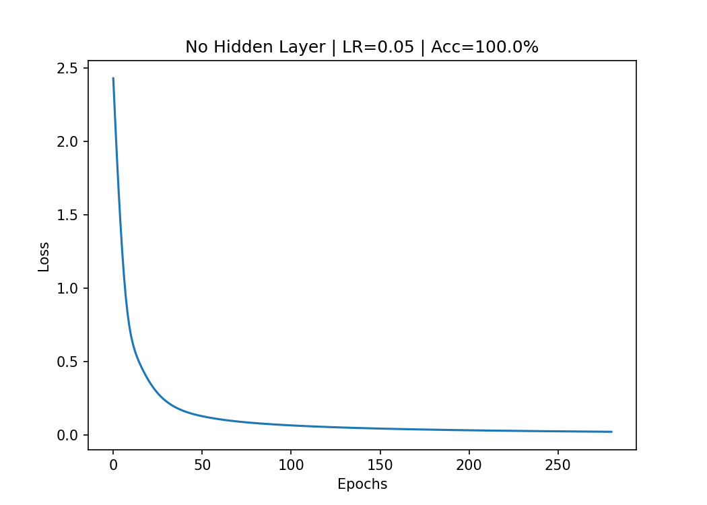
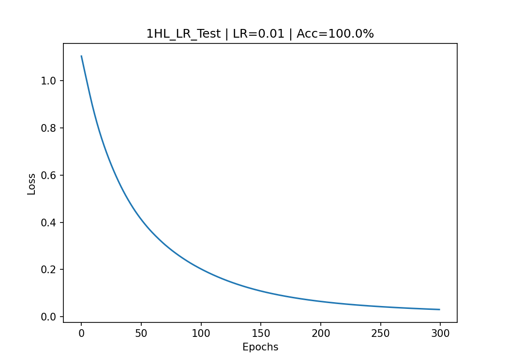
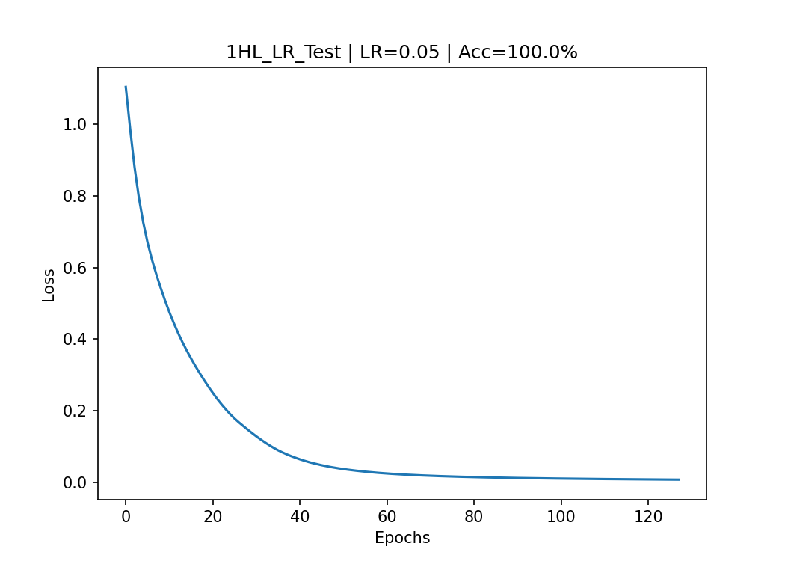
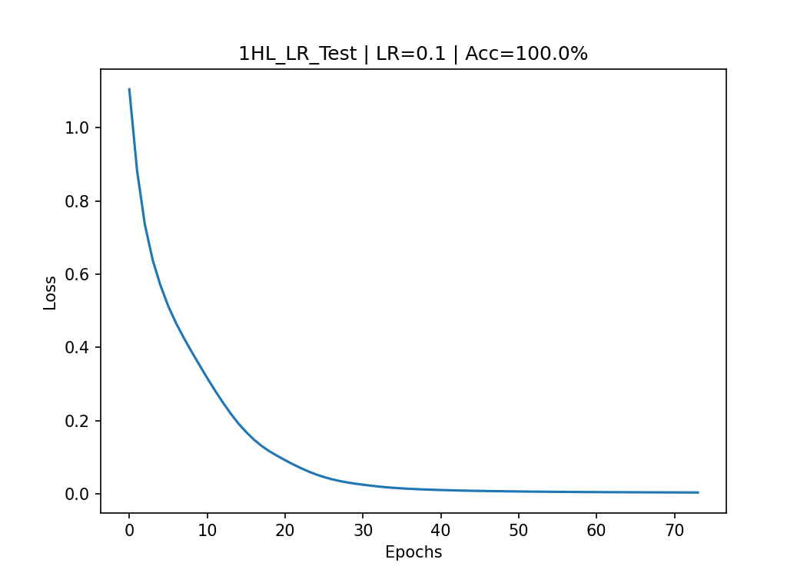

# Neural Network Classification Tool

## Project Overview

This project is a Python-based neural-network classification experiment using the
Iris flower dataset. It trains and compares several multilayer perceptron (MLP)
configurations to classify Iris samples from four numeric measurements:
sepal length, sepal width, petal length, and petal width.

The repository has been organized for readability so recruiters and technical
reviewers can quickly understand the problem, model design, experiment process,
and results.

## Problem Statement

The goal is to classify Iris flowers into one of three species based on measured
flower features. The project explores how neural-network structure and learning
rate affect training loss and classification accuracy.

## Features

- Loads and preprocesses Iris data from `data/Iris.csv`
- Selects four numeric input features
- Encodes species labels into numeric classes
- Standardizes feature values before training
- Splits data into training and test sets
- Trains neural-network classifiers with different hidden-layer configurations
- Compares learning rates across experiments
- Prints model accuracy
- Visualizes training loss curves

## Technologies Used

- Python
- pandas
- NumPy
- scikit-learn
- Matplotlib
- NetworkX
- SciPy

## Repository Structure

```text
Neural-Network-Classification-Tool/
|
+-- README.md
+-- IrisNeuralNetwork.py
+-- requirements.txt
+-- src/
|   +-- IrisNeuralNetwork.py
|   +-- Iris.py
|   +-- Sigmoid.py
|   +-- ass.py
|   +-- Caculation.py
|   +-- ParameterModulation.py
+-- data/
|   +-- Iris.csv
+-- screenshots/
|   +-- experiment and plot images
+-- docs/
|   +-- project-summary.md
+-- models/
```

## Dataset Description

The repository includes `data/Iris.csv`, which contains the Iris dataset. Each
row represents one Iris flower sample.

Input features:

- `SepalLengthCm`
- `SepalWidthCm`
- `PetalLengthCm`
- `PetalWidthCm`

Target label:

- `Species`

Detected classes:

- `Iris-setosa`
- `Iris-versicolor`
- `Iris-virginica`

## Model Architecture

The main script uses scikit-learn's `MLPClassifier`.

Configuration used in `src/IrisNeuralNetwork.py`:

- Activation function: ReLU
- Solver: Adam
- Maximum iterations: 200
- Random state: 0
- Tested hidden-layer configurations:
  - No hidden layer: `()`
  - One hidden layer with 4 neurons: `(4,)`
  - Two hidden layers with 4 neurons each: `(4, 4)`
- Tested learning rates:
  - `0.01`
  - `0.05`
  - `0.1`

## Training Process

1. Load the Iris CSV file.
2. Select the four numeric flower measurements as input features.
3. Use `Species` as the target label.
4. Encode species names into numeric labels.
5. Standardize numeric inputs with `StandardScaler`.
6. Split the dataset into training and test sets.
7. Train `MLPClassifier` models with different architectures and learning rates.
8. Plot loss curves and print accuracy for each experiment.

## Results and Accuracy

The experiments compare how hidden layers and learning rate affect model
performance. The main script prints accuracy after each run, and the included
plots show the model loss curve during training.

Verified run results from `python IrisNeuralNetwork.py`:

| Experiment | Learning Rate | Accuracy |
| --- | ---: | ---: |
| No hidden layer | `0.05` | `100.00%` |
| One hidden layer, 4 neurons | `0.05` | `100.00%` |
| Two hidden layers, 4 neurons each | `0.05` | `100.00%` |
| One hidden layer, 4 neurons | `0.01` | `96.67%` |
| One hidden layer, 4 neurons | `0.05` | `100.00%` |
| One hidden layer, 4 neurons | `0.1` | `100.00%` |

During verification, scikit-learn reported a convergence warning for some runs
because the script intentionally keeps `max_iter=200`. That setting was left
unchanged to preserve the original model behavior.

## Result Images

### No Hidden Layer



### One Hidden Layer

_LR0.05.png>)

### Two Hidden Layers

_LR0.05.png>)

### Learning Rate Comparison Outputs







## Challenges Encountered

- Preparing categorical species labels for neural-network training required label
  encoding.
- Neural networks are sensitive to feature scale, so the numeric inputs needed
  standardization before fitting.
- Different hidden-layer layouts and learning rates changed the shape of the loss
  curve, making experimentation important.
- Organizing generated plots separately from code made the project easier to
  review.

## What I Learned

- How to build a basic neural-network classification workflow in Python.
- How preprocessing steps such as label encoding and standardization affect model
  training.
- How to compare neural-network architectures using loss curves and accuracy.
- How learning rate can influence training behavior and convergence.
- How to structure a machine-learning repository so reviewers can quickly run and
  understand it.

## Setup Instructions

Create and activate a virtual environment if desired, then install dependencies:

```bash
pip install -r requirements.txt
```

Run the main Iris neural-network experiment:

```bash
python IrisNeuralNetwork.py
```

## Concise Recruiter Summary

Python neural-network classification project using the Iris dataset. Built an
MLP-based experiment pipeline with preprocessing, train/test splitting,
architecture comparison, learning-rate tuning, accuracy reporting, and loss-curve
visualization. The project demonstrates practical machine-learning fundamentals
and clean repository organization for reproducible review.
